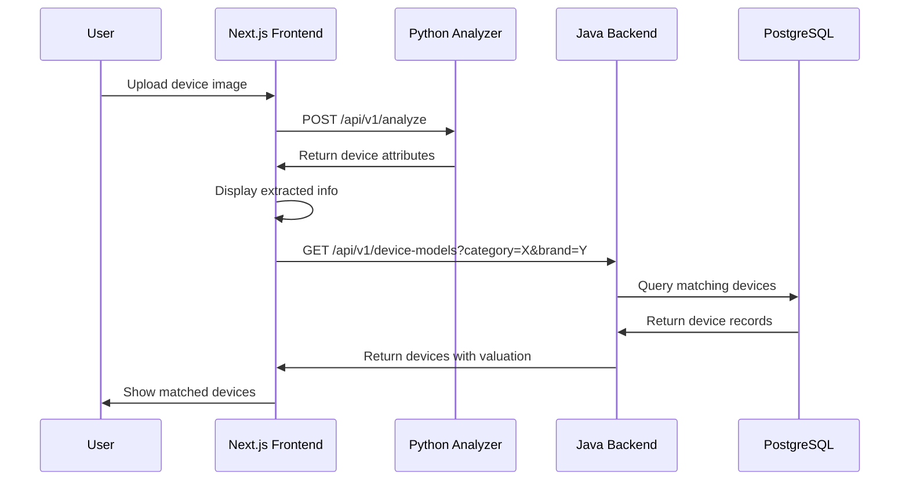

# E-locate Image Device Identification Service

A Python microservice that analyzes photos of electronic devices using Google's Gemini Vision API to extract structured device information for e-waste recycling workflows.

## Overview

This service integrates with the E-locate platform (Java Spring Boot backend + Next.js frontend) to enable automated device identification from images. It accepts image uploads and returns structured JSON responses with device attributes including category, brand, model, and confidence scores.

## Features

- Accept image uploads (JPEG, PNG, WebP) up to 10MB
- Extract device attributes: category, brand, model, device type, and visible characteristics
- Return structured JSON responses with confidence scores
- Database-compatible output for matching against existing device records
- Security validation, rate limiting, and error handling
- REST API endpoints with CORS support for frontend integration

## Project Structure

```
elocate-image-analyzer/
├── app/
│   ├── __init__.py
│   ├── main.py                 # FastAPI application entry point
│   ├── config.py               # Configuration and environment variables
│   ├── models/
│   │   ├── __init__.py
│   │   ├── request.py          # Request models
│   │   └── response.py         # Response models
│   ├── services/
│   │   ├── __init__.py
│   │   ├── gemini_service.py   # Gemini Vision API integration
│   │   ├── image_validator.py  # Image validation and security checks
│   │   └── analyzer.py         # Core analysis orchestration
│   ├── api/
│   │   ├── __init__.py
│   │   ├── routes.py           # API endpoint definitions
│   │   └── middleware.py       # CORS, rate limiting, auth middleware
│   └── utils/
│       ├── __init__.py
│       ├── logger.py           # Logging configuration
│       └── helpers.py          # Utility functions
├── tests/
│   ├── __init__.py
│   ├── test_analyzer.py
│   ├── test_validator.py
│   └── test_api.py
├── static/
│   └── test_interface.html     # Simple HTML test interface
├── requirements.txt
├── .env.example
├── .gitignore
└── README.md
```

## Setup

### Prerequisites

- Python 3.11 or higher
- Google Gemini API key (from Google AI Studio)

### Installation

1. Clone the repository and navigate to the service directory:
   ```bash
   cd elocate-image-analyzer
   ```

2. Create a virtual environment:
   ```bash
   python -m venv venv
   source venv/bin/activate  # On Windows: venv\Scripts\activate
   ```

3. Install dependencies:
   ```bash
   pip install -r requirements.txt
   ```

4. Create a `.env` file from the example:
   ```bash
   cp .env.example .env
   ```

5. Edit `.env` and add your configuration:
   - `GEMINI_API_KEY`: Your Google Gemini API key
   - `API_KEY`: A secure random key for service authentication
   - `ALLOWED_ORIGINS`: Comma-separated list of allowed CORS origins

### Running the Service

Development mode:
```bash
uvicorn app.main:app --reload --host 0.0.0.0 --port 8000
```

Production mode:
```bash
uvicorn app.main:app --host 0.0.0.0 --port 8000
```

The service will be available at `http://localhost:8000`

### API Documentation

Once running, visit:
- Swagger UI: `http://localhost:8000/docs`
- ReDoc: `http://localhost:8000/redoc`

## API Endpoints

### POST /api/v1/analyze

Analyze a device image and extract structured information.

**Request:**
- Method: `POST`
- Content-Type: `multipart/form-data`
- Headers: `X-API-Key: your_api_key`
- Body: Form data with `file` field containing the image

**Response:**
```json
{
  "success": true,
  "timestamp": "2024-01-15T10:30:45.123Z",
  "processingTimeMs": 3456,
  "data": {
    "category": "mobile",
    "brand": "Samsung",
    "model": "Galaxy S21",
    "deviceType": "smartphone",
    "confidenceScore": 0.87,
    "attributes": {
      "color": "phantom gray",
      "condition": "good",
      "visiblePorts": "USB-C"
    },
    "lowConfidence": false
  },
  "error": null
}
```

### GET /health

Health check endpoint.

**Response:**
```json
{
  "status": "healthy",
  "timestamp": "2024-01-15T10:30:45.123Z",
  "gemini_api_available": true
}
```

## Testing

Run unit tests:
```bash
pytest tests/
```

Run property-based tests:
```bash
pytest tests/test_properties.py
```

Run with coverage:
```bash
pytest --cov=app tests/
```

## Environment Variables

| Variable | Description | Default |
|----------|-------------|---------|
| `GEMINI_API_KEY` | Google Gemini API key | Required |
| `API_KEY` | Service authentication key | Required |
| `ALLOWED_ORIGINS` | CORS allowed origins (comma-separated) | `http://localhost:3000` |
| `MAX_FILE_SIZE_MB` | Maximum upload size in MB | `10` |
| `LOG_LEVEL` | Logging level (DEBUG, INFO, WARNING, ERROR) | `INFO` |
| `REQUEST_TIMEOUT` | Request timeout in seconds | `30` |
| `RATE_LIMIT` | Rate limit per IP | `10/minute` |

## Deployment

### Docker Deployment

Build the Docker image:
```bash
docker build -t elocate-image-analyzer .
```

Run the container:
```bash
docker run -d \
  -p 8000:8000 \
  -e GEMINI_API_KEY=your_gemini_key \
  -e API_KEY=your_api_key \
  -e ALLOWED_ORIGINS=http://localhost:3000 \
  --name image-analyzer \
  elocate-image-analyzer
```

### Railway Deployment

1. Install Railway CLI:
   ```bash
   npm install -g @railway/cli
   ```

2. Login to Railway:
   ```bash
   railway login
   ```

3. Initialize project:
   ```bash
   railway init
   ```

4. Add environment variables in Railway dashboard:
   - `GEMINI_API_KEY`: Your Google Gemini API key
   - `API_KEY`: Service authentication key
   - `ALLOWED_ORIGINS`: Your frontend URL (e.g., `https://your-app.vercel.app`)
   - `PORT`: 8000

5. Deploy:
   ```bash
   railway up
   ```

6. Get your service URL:
   ```bash
   railway domain
   ```

### Render Deployment

1. Create a `render.yaml` file (already included in project)

2. Connect your repository to Render:
   - Go to https://dashboard.render.com
   - Click "New +" → "Web Service"
   - Connect your Git repository
   - Select the `elocate-image-analyzer` directory

3. Configure environment variables in Render dashboard:
   - `GEMINI_API_KEY`: Your Google Gemini API key
   - `API_KEY`: Service authentication key
   - `ALLOWED_ORIGINS`: Your frontend URL
   - `PYTHON_VERSION`: 3.11.0

4. Deploy settings:
   - Build Command: `pip install -r requirements.txt`
   - Start Command: `uvicorn app.main:app --host 0.0.0.0 --port $PORT`

5. Click "Create Web Service"

### Google Cloud Run Deployment

1. Install Google Cloud SDK and authenticate:
   ```bash
   gcloud auth login
   gcloud config set project YOUR_PROJECT_ID
   ```

2. Build and push to Google Container Registry:
   ```bash
   gcloud builds submit --tag gcr.io/YOUR_PROJECT_ID/image-analyzer
   ```

3. Deploy to Cloud Run:
   ```bash
   gcloud run deploy image-analyzer \
     --image gcr.io/YOUR_PROJECT_ID/image-analyzer \
     --platform managed \
     --region us-central1 \
     --allow-unauthenticated \
     --set-env-vars GEMINI_API_KEY=your_key,API_KEY=your_key,ALLOWED_ORIGINS=https://your-frontend.com
   ```

4. Get the service URL from the output

### Environment Configuration for Production

Create a `.env` file with production values:

```env
# Required
GEMINI_API_KEY=your_google_gemini_api_key_here
API_KEY=your_secure_random_api_key_here

# CORS Configuration
ALLOWED_ORIGINS=https://your-frontend.vercel.app,https://your-domain.com

# Optional (with defaults)
MAX_FILE_SIZE_MB=10
LOG_LEVEL=INFO
REQUEST_TIMEOUT=30
RATE_LIMIT=10/minute
```

### Health Checks

All deployment platforms should configure health checks:
- **Endpoint**: `GET /health`
- **Expected Status**: 200
- **Interval**: 30 seconds
- **Timeout**: 10 seconds
- **Retries**: 3

## Integration with E-locate Platform

This service is designed to work alongside:
- **Next.js Frontend** (Elocate/): User interface for image upload
- **Java Spring Boot Backend** (elocate-server/): Device database and business logic
- **PostgreSQL Database**: Device categories, brands, and models

### Integration Workflow



### Frontend Integration (Next.js)

Add the Python service URL to your Next.js environment variables:

```env
# .env.local
NEXT_PUBLIC_IMAGE_ANALYZER_URL=https://your-image-analyzer.railway.app
NEXT_PUBLIC_IMAGE_ANALYZER_API_KEY=your_api_key
```

Example frontend code:

```typescript
// lib/image-analyzer-api.ts
export async function analyzeDeviceImage(file: File) {
  const formData = new FormData();
  formData.append('file', file);

  const response = await fetch(
    `${process.env.NEXT_PUBLIC_IMAGE_ANALYZER_URL}/api/v1/analyze`,
    {
      method: 'POST',
      headers: {
        'X-API-Key': process.env.NEXT_PUBLIC_IMAGE_ANALYZER_API_KEY!,
      },
      body: formData,
    }
  );

  if (!response.ok) {
    throw new Error('Image analysis failed');
  }

  return response.json();
}
```

```typescript
// components/DeviceImageUpload.tsx
import { analyzeDeviceImage } from '@/lib/image-analyzer-api';

export function DeviceImageUpload() {
  const handleFileUpload = async (e: React.ChangeEvent<HTMLInputElement>) => {
    const file = e.target.files?.[0];
    if (!file) return;

    try {
      const result = await analyzeDeviceImage(file);
      
      if (result.success) {
        console.log('Device identified:', result.data);
        // Query Java backend for matching devices
        const devices = await fetchMatchingDevices(
          result.data.category,
          result.data.brand,
          result.data.model
        );
        // Display results to user
      } else {
        console.error('Analysis failed:', result.error);
      }
    } catch (error) {
      console.error('Upload failed:', error);
    }
  };

  return (
    <input
      type="file"
      accept="image/jpeg,image/png,image/webp"
      onChange={handleFileUpload}
    />
  );
}
```

### Backend Integration (Java Spring Boot)

The Java backend should implement fuzzy matching for device lookups:

```java
// Example endpoint in Java backend
@GetMapping("/api/v1/device-models/search")
public ResponseEntity<List<DeviceModel>> searchDevices(
    @RequestParam String category,
    @RequestParam(required = false) String brand,
    @RequestParam(required = false) String model
) {
    // Implement fuzzy matching logic
    List<DeviceModel> matches = deviceService.findMatchingDevices(
        category, brand, model
    );
    return ResponseEntity.ok(matches);
}
```

### Testing the Integration

Use curl to test the service:

```bash
# Test health endpoint
curl http://localhost:8000/health

# Test image analysis
curl -X POST http://localhost:8000/api/v1/analyze \
  -H "X-API-Key: your_api_key" \
  -F "file=@/path/to/device-image.jpg"

# Test with verbose output
curl -X POST http://localhost:8000/api/v1/analyze \
  -H "X-API-Key: your_api_key" \
  -F "file=@/path/to/device-image.jpg" \
  -v

# Test error handling (oversized file)
curl -X POST http://localhost:8000/api/v1/analyze \
  -H "X-API-Key: your_api_key" \
  -F "file=@/path/to/large-file.jpg"

# Test authentication
curl -X POST http://localhost:8000/api/v1/analyze \
  -F "file=@/path/to/device-image.jpg"
# Should return 401 Unauthorized
```

### Service URLs

After deployment, update your frontend configuration:

- **Railway**: `https://your-service.railway.app`
- **Render**: `https://your-service.onrender.com`
- **Google Cloud Run**: `https://image-analyzer-xxxxx-uc.a.run.app`

Add the service URL to your Next.js environment variables and redeploy the frontend.

## License

Part of the E-locate platform.


## 📚 Documentation

All documentation has been organized in the [`docs/`](docs/) folder:

- **[Deployment Guide](docs/RAILWAY_DEPLOYMENT_GUIDE.md)** - Deploy to Railway
- **[Testing Guide](docs/HOW_TO_TEST.md)** - Test the deployed API
- **[Troubleshooting](docs/RAILWAY_TROUBLESHOOTING.md)** - Fix deployment issues
- **[API Quota Guide](docs/GEMINI_API_QUOTA_GUIDE.md)** - Manage Gemini API quota
- **[Full Documentation Index](docs/README.md)** - Complete documentation list

## 🧪 Testing

All test files are in the [`tests/`](tests/) folder:

- **[Test Documentation](tests/README.md)** - Complete testing guide
- **Database Tests:** `python tests/test_local_db.py`
- **API Tests:** `.\tests\test_api.ps1`
- **Railway Tests:** `.\tests\test_railway_deployment.ps1`
- **Unit Tests:** `pytest tests/`

## 🚀 Quick Start

### Local Development

1. **Install dependencies:**
   ```bash
   pip install -r requirements.txt
   ```

2. **Set up environment variables:**
   ```bash
   cp .env.example .env
   # Edit .env with your API keys
   ```

3. **Run the server:**
   ```bash
   python run.py
   ```

4. **Test the API:**
   - Visit: http://localhost:8000/docs
   - Or run: `python tests/test_local_db.py`

### Deploy to Railway

1. **Import environment variables:**
   - Use `railway-env.json` in Railway dashboard

2. **Deploy:**
   ```bash
   railway up
   ```

3. **Test deployment:**
   ```bash
   .\tests\test_railway_deployment.ps1
   ```

See [docs/RAILWAY_DEPLOYMENT_GUIDE.md](docs/RAILWAY_DEPLOYMENT_GUIDE.md) for detailed instructions.

## 🔗 Live Deployment

**Railway URL:** https://elocate-python-production.up.railway.app

**API Endpoints:**
- Health: `/health`
- Docs: `/docs`
- Analyze: `/api/v1/analyze`

## 📊 Status

- ✅ Local testing: All tests passing
- ✅ Database: Connected (Supabase)
- ✅ Gemini API: Active
- 🔄 Railway: Deploying...

See [docs/READY_TO_DEPLOY.md](docs/READY_TO_DEPLOY.md) for current status.
